  
  

<!-- Terminal Card -->

  

---

## 👋 About

I’m a developer focused on building AI systems, automation tools, and full-stack applications.

I care more about clean architecture, scalability, and real-world usability than hype or surface-level demos.

- 🧠 AI systems & agent-based workflows  
- 🏗️ Backend development (backend + APIs)  
- ⚙️ Developer tooling & automation  
- ⛓️ Exploring blockchain integrations & onchain systems  
- ⚡ Stack: TypeScript, TypeScript, Python, C/C++, Node.js  

---

## 🚀 What I Build

### 🧠 AI & Automation
Practical AI systems and workflows that reduce manual effort and improve developer productivity.

### 🏗️ Backend Apps
Production-grade web applications with scalable architecture and clean backend design.

### ⚙️ Developer Tools
CLI tools, automation scripts, and infrastructure utilities for faster workflows.

---

## 🧰 Tech Stack

### 🧑‍💻 Languages

---

### 🤖 AI & Agent Systems

---

### ⚙️ Backend & Full Stack

---

### ☁️ Cloud & DevOps

---

### 🧰 Tools

---

## 📊 GitHub Stats

<table>
  <tr>
    <td>
      
    </td>
    <td>
      
    </td>
  </tr>
</table>

---

## 🏆 Trophies

---

## 🐍 Contribution Snake

---

## 📬 Contact

---

  

